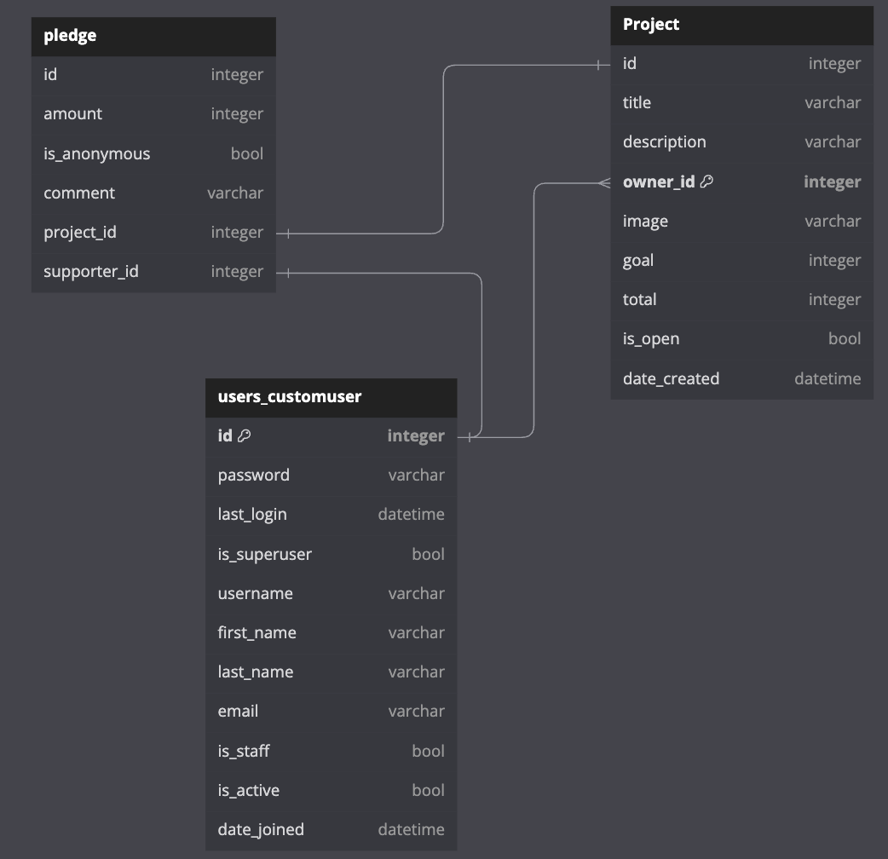
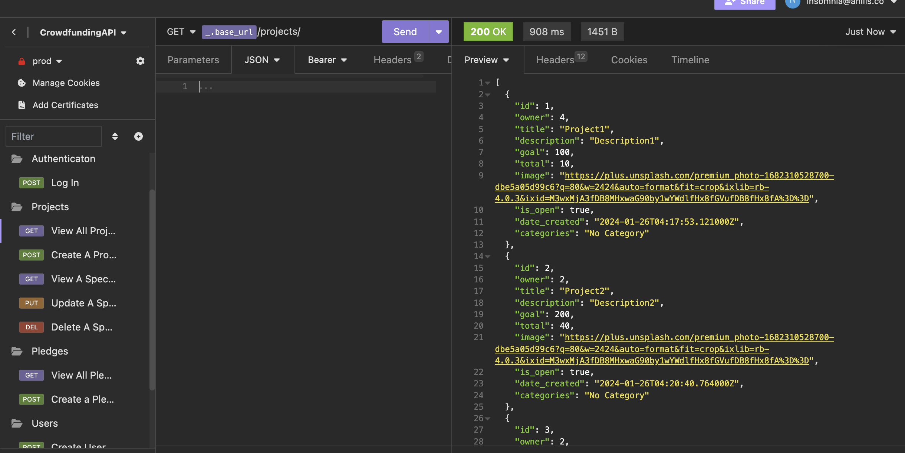
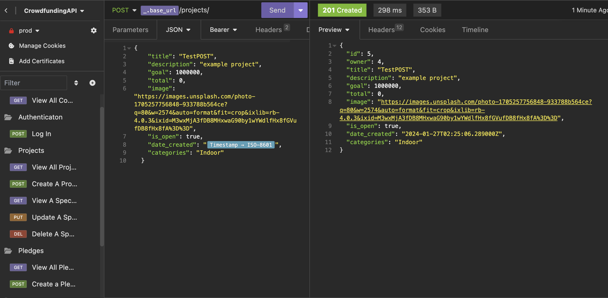
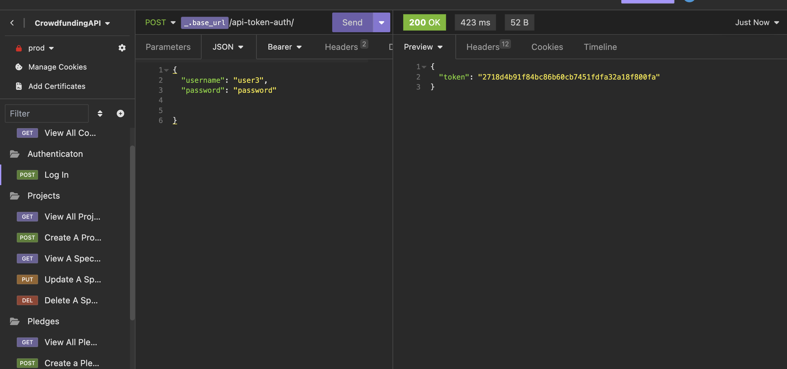

# CROWDFUNDING BACK END
View the deployed site at: https://crowdfunding-back-end18472.fly.dev/projects/

## Planning:
### SproutSeeds
Welcome to SproutSeeds - where edible garden dreams come true! Our crowdfunding platform links aspiring gardeners with a supportive community, helping you kickstart your own fresh haven. Share your vision, set achievable goals, and engage with fellow enthusiasts. Thank backers and celebrate the harvest together through regular updates. Join us in cultivating a greener, healthier world — one garden at a time! 

### Intended Audience/User Stories
Coming soon.  

### Front End Pages/Functionality 
Coming soon. 

### API Spec
| Endpoint         | Method | Request Body           | Authentication Required?            | Implemented? |
|------------------|--------|----------------|-------------------------------------|--------------|
| /projects/       | GET    |                | No                                  | Yes          |
| /projects/       | POST   | Project Object | Yes                                 | Yes          |
| /projects/1/     | GET    | Project Object | No                                  | Yes          |
| /projects/1/     | PUT    | Project Object | Yes Must be project owner           | Yes          |
| /projects/1/     | DELETE | Project Object | Yes Must be project owner           | Yes          |
| /pledges/        | GET    |                | No                                  | Yes          |
| /pledges/        | POST   | Pledge Object  | Yes                                 | Yes          |
| /users/          | GET    |                | Yes Must be admin                   | No           |
| /users/          | POST   | User Object    | No                                  | Yes          |
| /users/1/        | GET    | User Object    | No                                  | No           |
| /users/1         | PUT    | User Object    | Yes Request user must equal user id | No           |
| /api-token-auth/ | POST   | User           | N/A                                 | Yes          |

### DB Schema

### How to Create Users and Projects using Insomnia
| Object  | URL                                                  | Example Request Body                                                                                                                                                | Response Code - Success | Response Code - Failure                                                                                                                                           |
|---------|------------------------------------------------------|---------------------------------------------------------------------------------------------------------------------------------------------------------------------|-------------------------|-------------------------------------------------------------------------------------------------------------------------------------------------------------------|
| User    | https://crowdfunding-back-end18472.fly.dev/users/    | {    "username": [Enter your information here],    "password": [Enter password here] }                                                                               | 200 Accepted            | If you are already authenticated as a user:  403 Forbidden - "You cannot create another user while logged in"    Required fields not submitted 400 Bad Request |
| Project | https://crowdfunding-back-end18472.fly.dev/projects/ | {    "title": "Title",    "description": "Description",    "goal": 1000,    "image": "enter a URL here",    "is_open": true/false,    "date_created: "ISO-8601 String" } | 201 Created             | 401 Unauthorized:"Authentication credentials were not provided."   400 Bad Request: Required fields not submitted                                              |

Creating a User
1. From your Insomnia dashboard, create a Collection. 
2. In a Collection, select New Request.
3. In the New Request modal: 
    - Select a POST method from the dropdown. 
    - Enter https://crowdfunding-back-end18472.fly.dev/users/ in the request URL field.
    - Change the request body to JSON and enter the below block of code:

        '''

            {
            "username": [Enter your information here],
            "password": [Enter password here],
            "email": ""
            }

        '''

    - Click Send

Request an Authentication Token
1. Create a new HTTP request
2. Select a POST method from the dropdown. 
    - Enter https://crowdfunding-back-end18472.fly.dev/api-token-auth/ in the request URL field. 
3. Change the request body to JSON and enter your username and password in this format:

        {
            "username": [Enter your information here],
            "password": [Enter password here]
        }
4. You will receive a token as a response. For any further requests which require authentication, you will need to enter this under the Auth tab. 
5. In the Auth tab, select "Bearer Token". Ensure this is enabled, enter your token in the Token field, and enter "Token" in the Prefix field. 

Creating a Project
1. Ensure you have followed the steps above to be authenticated. 
2. Create a new HTTP request. 
3. Select a POST method from the dropdown. 
    - Enter https://crowdfunding-back-end18472.fly.dev/projects/ in the request URL field. 
4. Change the request body to JSON and enter the information below: 

    '''

        {
            "title": "Title" 
            "description": "Description" 
            "goal": 1000 
            "image": "enter a URL here" 
            "is_open": true/false 
            "date_created: "ISO-8601 String" 
        }
    '''

### Insomnia Screenshots

 

# Your crowdfunding project must:
    [TBC] Be separated into two distinct projects: an API built using the Django RestFramework and a website built using React.
    
    [X] Have a cool name, bonus points if it includes a pun and/or missing vowels. See https://namelix.com/ for inspiration. (Bonus Points are meaningless)
    [X] Have a clear target audience.
    [X] Have user accounts. A user should have at least the following attributes:
        [X] Username
        [X] Email address
        [X] Password
    [X] Ability to create a “project” to be crowdfunded which will include at least thefollowing attributes:
        [X] Title
        [X] Owner (a user)
        [X] Description
        [X] Image
        [X] Target amount to fundraise
        [X] Whether it is currently open to accepting new supporters or not
        [X] When the project was created
    [X] Ability to “pledge” to a project. A pledge should include at least the followingattributes:
        [X] An amount
        [X] The project the pledge is for
        [X] The supporter/user (i.e. who created the pledge)
        [X] Whether the pledge is anonymous or not
        [X] A comment to go along with the pledge
    [ ] Implement suitable update/delete functionality, e.g. should a project owner beallowed to update a project description?
    [X] Implement suitable permissions, e.g. who is allowed to delete a pledge? - 
    [X] Return the relevant status codes for both successful and unsuccessful requeststo the API.
    [X] Handle failed requests gracefully (e.g. you should have a custom 404 pagerather than the default error page).
    [X] Use Token Authentication.
    [TBC] Implement responsive design.

